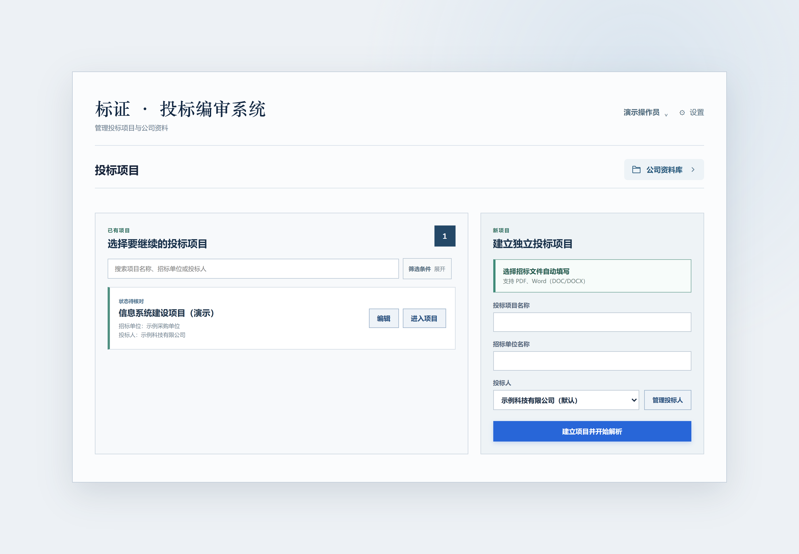
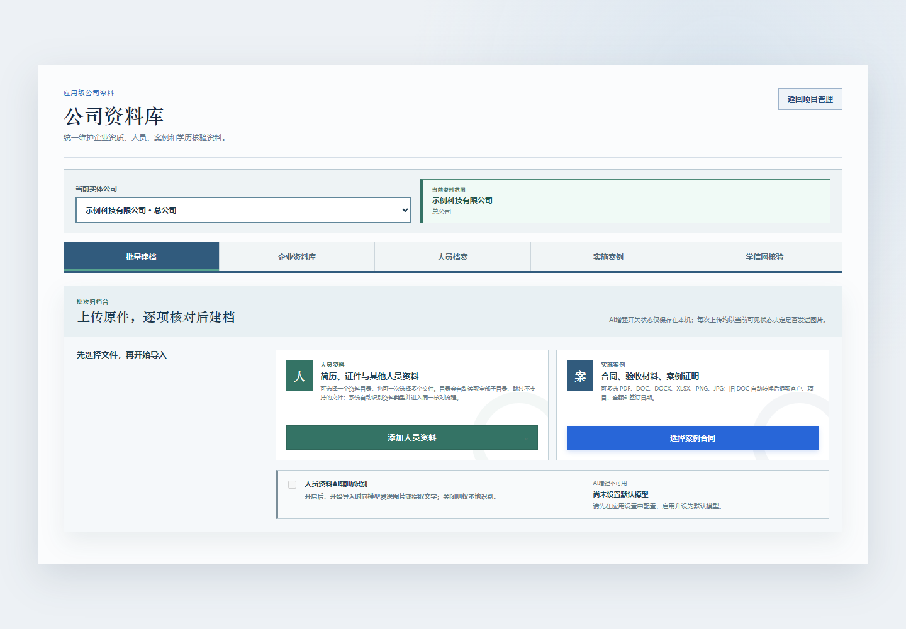
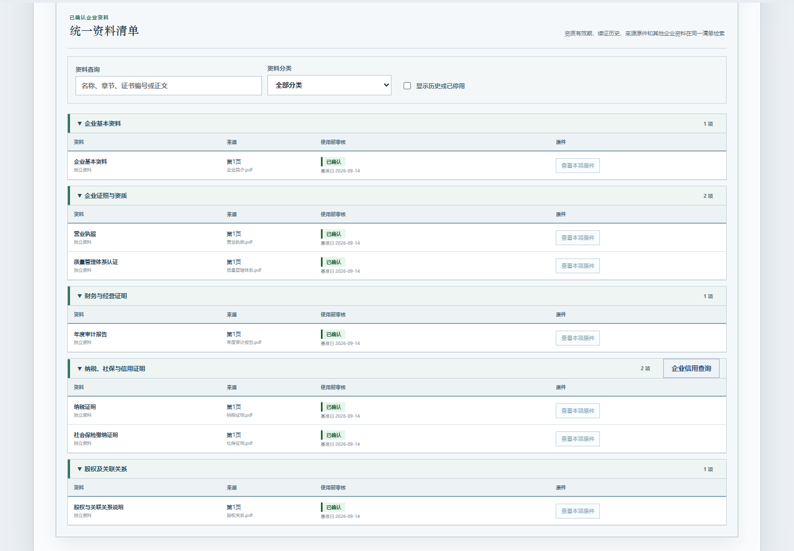
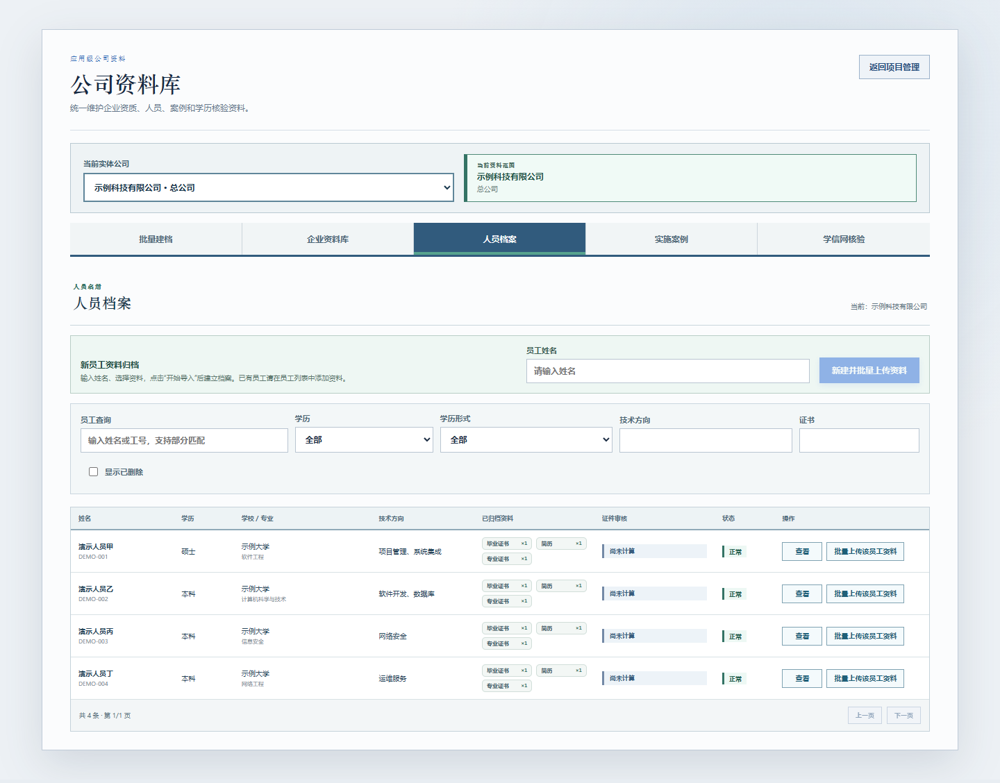
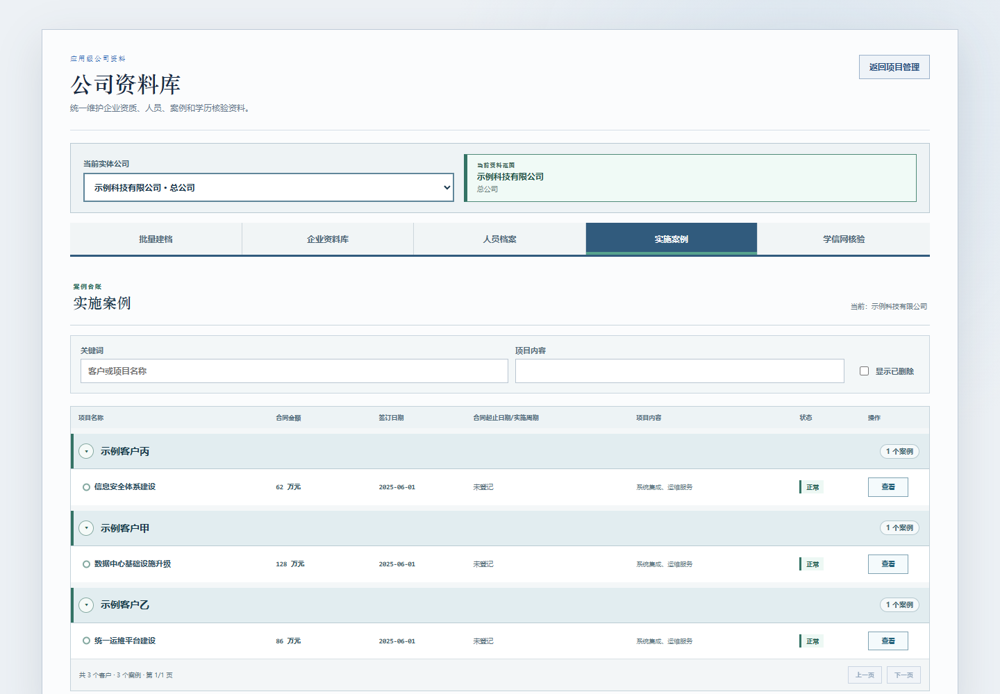
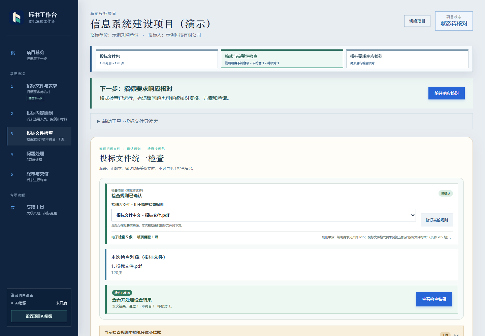

  

  面向 Windows 的本地标书检查与材料整理工具 
  从企业与人员资料，到投标文件核对，再到人工终审与归档。

  <a href="https://github.com/yaoyouzhong/Bidding-releases/releases/download/v0.4.1/Biaoshu_0.4.1_x64-setup.exe"><strong>下载 Windows 安装包 ↗</strong></a>
  &nbsp; · &nbsp;
  <a href="https://github.com/yaoyouzhong/Bidding-releases/releases/latest">版本与下载</a>
  &nbsp; · &nbsp;
  <a href="#开始使用">开始使用</a>
  &nbsp; · &nbsp;
  <a href="#自动更新">自动更新</a>

Windows 10 / 11 · x64 &nbsp;&nbsp; | &nbsp;&nbsp; 本地资料管理 &nbsp;&nbsp; | &nbsp;&nbsp; AI 增强按需开启

---

> **使用用途：仅供学习与交流，不用于任何商业用途。**
> 本项目免费提供，用于学习和交流文档处理、OCR 与信息核对技术；请勿用于商业投标、收费服务或其他商业活动。
> 第三方组件仍按各自许可证提供；本声明不替代其许可，也不表示已取得第三方额外授权。

## 工作台一览

当前前端的隔离渲染截图，项目名称与单位均为合成演示数据，不包含真实业务资料。

## 一条完整的复核流程

不必在散落的文件、表格和备注中来回寻找。围绕同一个项目整理材料、运行检查、处理问题，再由人工确认终审。

## 走进工作台：从材料入库到证据复核

以下截图来自当前前端的隔离演示环境，使用合成企业、人员和文档数据；展示实际界面，不代表真实业务验收结果。点击图片可查看大图。

### 01 · 批量建档

从人员资料或案例合同开始导入，识别后逐项核对；AI 辅助识别由用户主动开启。

### 02 · 企业资料集中管理

证照资质、审计报告、纳税社保与关联关系分类展示，来源和使用审核状态一目了然。

### 03 · 人员档案与证件归属

按姓名、学历和技术方向查找人员，将简历、学历证明与专业证书归到同一份档案。

### 04 · 实施案例按客户整理

同一客户下查看项目、合同金额、签订时间和项目内容，方便检索与后续选用。

### 05 · 按招标要求检查投标文件

先确认检查规则，再对当前文件包运行格式与完整性检查，明确区分通过、不符合和待核对。

### 06 · 对着原件处理每一项发现

左侧查看检查项，右侧对照招标要求、物理页和整页证据，再记录人工结论。

机器提示供人工判断，不自动认定合规、计分或串标成立。

## 本机资料与可选 AI

**材料默认保存在本机，AI 增强默认关闭。** 开启相应用途后才发送相关内容；官网查询则访问对应官方网站。模型识别结果和机器检查不能替代人工终审。

## 开始使用

[程序下载 · GitHub](https://github.com/yaoyouzhong/Bidding-releases/releases) · [模型修复 · Gitee](https://gitee.com/yaoyouzhong/Bidding-releases/releases/tag/models-v1)

Gitee 模型修复文件已可用。Gitee 单个附件上限为 100 MB，无法容纳本版完整安装包和程序更新包；程序下载目前请使用 GitHub。

**1. 安装工作台**  
普通用户选择 **EXE 安装包**，保留默认安装位置即可使用应用内更新。无需另装 Python、Node 或 Rust。

**2. 建立投标人和项目**  
按当前项目整理企业、人员资料，导入招标文件与投标文件。

**3. 检查、复核、归档**  
结合原件核对检查结果，处理问题，再进行人工终审与交付归档。

| 安装方式 | 适合的使用方式 | 下载 |
| :--- | :--- | :--- |
| **EXE · 推荐** | 当前用户安装，支持应用内更新 | [下载 0.4.1](https://github.com/yaoyouzhong/Bidding-releases/releases/download/v0.4.1/Biaoshu_0.4.1_x64-setup.exe) |

<strong>安装环境与下载校验</strong>

- 支持 Windows 10 / 11 x64。
- 界面使用 Microsoft Edge WebView2，首次安装建议保持联网。
- 企业信用与学历官网查询需要安装 Google Chrome；需要人工验证时，按官网提示操作。
- 安装包尚未取得 Windows Authenticode 签名；可通过同版 [SHA256SUMS.txt](https://github.com/yaoyouzhong/Bidding-releases/releases/download/v0.4.1/SHA256SUMS.txt) 核对文件完整性。

## OCR 模型

安装包已内置 Beta 验证码识别和文档检测、识别、方向共 4 个 OCR 模型，安装后可直接进行本地识别。应用设置保留“下载模型”和“导入模型”，用于缺失或损坏时修复；模型完整时显示已就绪。

如需离线修复，下载下列原始 `.onnx` 文件，点击“导入模型”选择一个或多个文件。旧版模型附件继续保留，本版只使用以下四个。

<strong>四个模型修复文件</strong>

| 用途 | 文件 | 国内下载 | 备用下载 |
| :--- | :--- | :--- | :--- |
| 验证码 Beta | `common.onnx` | [Gitee](https://gitee.com/yaoyouzhong/Bidding-releases/releases/download/models-v1/common.onnx) | [GitHub](https://github.com/yaoyouzhong/Bidding-releases/releases/download/models-v1/common.onnx) |
| 文档文字检测 | `PP-OCRv6_det_small.onnx` | [Gitee](https://gitee.com/yaoyouzhong/Bidding-releases/releases/download/models-v1/PP-OCRv6_det_small.onnx) | [GitHub](https://github.com/yaoyouzhong/Bidding-releases/releases/download/models-v1/PP-OCRv6_det_small.onnx) |
| 文档文字识别 | `PP-OCRv6_rec_small.onnx` | [Gitee](https://gitee.com/yaoyouzhong/Bidding-releases/releases/download/models-v1/PP-OCRv6_rec_small.onnx) | [GitHub](https://github.com/yaoyouzhong/Bidding-releases/releases/download/models-v1/PP-OCRv6_rec_small.onnx) |
| 文字方向 | `ch_ppocr_mobile_v2.0_cls_mobile.onnx` | [Gitee](https://gitee.com/yaoyouzhong/Bidding-releases/releases/download/models-v1/ch_ppocr_mobile_v2.0_cls_mobile.onnx) | [GitHub](https://github.com/yaoyouzhong/Bidding-releases/releases/download/models-v1/ch_ppocr_mobile_v2.0_cls_mobile.onnx) |

## 自动更新

**从 0.3.0 开始，更新能力已包含在程序中。**

启动后自动检查新版本。发现更新时，应用设置中显示提醒；查看说明、保存工作并确认后，点击 **「一键升级」**，程序会下载并验证签名，安装完成后重启。

更新前保留旧版备份，新版启动失败时尝试恢复旧版。后台任务运行期间不能安装更新；历史机器级 MSI 安装，以及涉及数据库结构变化的版本，使用另行验证的完整安装包升级。

## 当前版本

**0.4.1** 内置完整 OCR 模型，安装后无需单独下载；更新优先使用 Gitee，失败后尝试 GitHub，始终验证更新包签名。下载模型与导入模型入口继续保留。

GitHub 保留历史版本；Gitee 以最新版程序附件为主。新包验证通过后才切换更新清单，容量允许时先上传再清理。

[阅读完整版本说明 →](RELEASE_NOTES.md)

<strong>已验证范围与当前边界</strong>

- 0.4.1 安装包内置四个固定模型，冻结引擎模型检查与 Beta 验证码识别通过；安装包和签名更新包内的程序文件一致。
- v0.4.0 EXE 与 MSI 分别完成独立 Windows Sandbox 安装生命周期与合成业务验证。
- v0.3.0 → v0.4.0 的正常升级与中断恢复已验证，并核对项目数据库保持不变。
- 本轮不包含无 WebView2 的离线安装、同版本覆盖安装、真实个人学信网查询及跨机器 GPU 性能验收。

## 数据与可选 AI

材料默认保存在本机。AI 增强默认关闭，配置模型并明确开启相应用途后，才发送相关内容。官网查询按用户发起的操作访问对应网站；请按业务需要备份重要资料。

反馈问题时，请提供脱敏后的操作步骤和错误提示，**不要上传真实投标材料、身份证件、项目数据库或密钥**。

## 关于本仓库

这里是标书工作台的**公开分发仓库**，提供安装包、签名更新包、校验值与使用说明。业务源码及开发历史保留私有。

[第三方组件说明](THIRD_PARTY_NOTICES.md) · [GEOS 分发与兼容库说明](GEOS_DISTRIBUTION.md) · [全部版本](https://github.com/yaoyouzhong/Bidding-releases/releases)

第三方许可证与源码资料

Release 中的 `licenses.zip` 提供第三方许可证原文，`sources.zip` 仅包含第三方库源码及构建参考，不是标书工作台业务源码。相关材料也位于安装目录的 `third-party.zip`，随程序更新或恢复。

第三方组件按各自许可证提供，相应权利不受本程序其他说明限制。GEOS 的使用与修改权利见对应说明，普通用户无需替换该库。

---

标书工作台 · 整理有序，复核有据。

