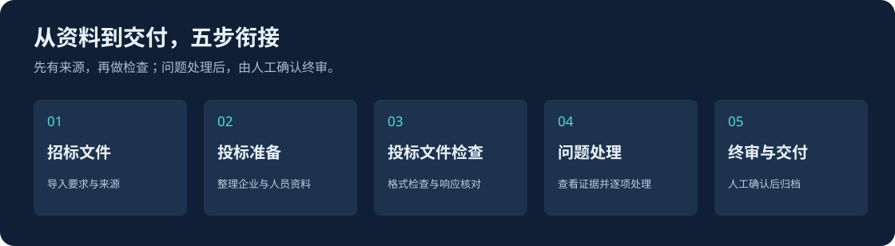
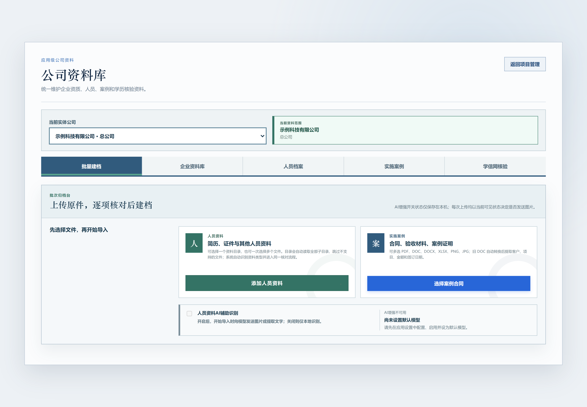

  

  AI 辅助理解要求与材料，按招标格式编制并逐项复核 
  让投标人少做重复整理，把精力用在关键要求与方案上。

  <a href="https://github.com/yaoyouzhong/Bidding-releases/releases/download/v0.4.1/Biaoshu_0.4.1_x64-setup.exe"><strong>下载 Windows 安装包 ↗</strong></a>
  &nbsp; · &nbsp;
  <a href="https://github.com/yaoyouzhong/Bidding-releases/releases/latest">版本与下载</a>
  &nbsp; · &nbsp;
  <a href="#开始使用">开始使用</a>
  &nbsp; · &nbsp;
  <a href="#自动更新">自动更新</a>

Windows 10 / 11 · x64 &nbsp;&nbsp; | &nbsp;&nbsp; 本地资料管理 &nbsp;&nbsp; | &nbsp;&nbsp; AI 增强按需开启

---

> **使用用途：仅供学习与交流，不用于任何商业用途。**
> 本项目免费提供，用于学习和交流文档处理、OCR 与信息核对技术；请勿用于商业投标、收费服务或其他商业活动。
> 第三方组件仍按各自许可证提供；本声明不替代其许可，也不表示已取得第三方额外授权。

## 把时间留给方案，把重复整理和关键核对交给工作台

投标人真正费力的，往往是这些具体工作：**同一批人员，每个项目重新套简历格式；证件明明齐了，却可能过期或不符合本次要求；投标文件写了很多页，仍担心漏掉一项资格条件或承诺。**

标书工作台围绕这三类问题设计。资料库、OCR、模板识别和官网核验服务于同一件事：**按本次招标要求准备材料，把需要处理的缺口和依据交到复核人面前。**

下方为当前前端的合成资料演示，不含真实业务与个人信息。图片可打开高清原图查看；演示不代替实际业务验收。

## AI 的价值：把“需要读懂内容”的工作接进流程

招标条件的写法不同，简历和证书的版式不同，投标响应也未必沿用招标原文。AI 在这里承担内容理解：从材料中提取信息、整理要求、分析响应与证据之间的关系，把原本需要逐份阅读和判断的工作转化为可核对的候选与建议。

| 遇到的具体问题 | AI 在项目中承担的工作 | 用户得到什么 |
| :--- | :--- | :--- |
| 同一类资格或评分要求，在不同招标文件里写法不同 | 从招标内容中智能提取要求候选，保留原文与定位 | 在候选基础上确认本项目要求，减少逐段摘录。 |
| 简历、证书和合同版式不同，字段要靠人逐份找 | 开启后用文本或视觉模型辅助提取人员、证照和案例信息，补充本地解析与 OCR | 将不同来源整理为可审核的档案字段，为后续套用招标格式提供资料。 |
| 关键词出现了，却不确定是否真正回应要求 | 在已有逐项核对基础上，结合要求、候选响应片段和证据状态进行语义复核 | 获得响应充分性与缺口的辅助判断，再对照原文确认。 |
| 两份方案换了说法或重排段落，普通字面比对难以解释 | 可选 AI 语义识别，分析候选片段中的改写相似、共同异常和特殊配置组合，并扣除公共来源影响 | 查看双方引用与关联线索，辅助人工复核。 |
| 起草响应内容时，容易写出资料无法支撑的承诺 | 有依据的响应起草能力结合要求和关联材料生成草稿 | 获得供人工修改的候选文字，继续核对引用与事实依据。 |

**AI 帮助理解，程序负责落实，用户保留判断。** 日期计算、模板填充、批量生成和检查流程由程序执行；AI 输出保留为候选、草稿或复核建议。缺失信息、识别冲突与证据不足需要处理，不会因为模型给出答案就自动通过终审。

**价值落在具体输出里：** 提取的要求能回到来源原文，档案字段能核对原件，响应建议能查看相关片段，生成的草稿能看到待补缺项。用户可以检查 AI 做了什么，再决定采用哪些结果。

AI 增强默认关闭，按用途授权后使用所配置的模型。

## 每换一个项目，都要重新填几十份简历？

人员资料基本相同，招标方要求的人员清单、简历表格和字段排列却各不相同。逐人复制粘贴，既耗时，也容易填错行、漏字段，或沿用上个项目的信息。

**围绕招标文件里的模板，批量生成人员材料。** 工作台定位人员清单和简历格式，供用户核对模板与字段对应关系；选定人员、项目角色和顺序后，自动带入已确认资料，生成同一份人员清单与招标格式简历 Word。

| 用户确定什么 | 系统接着完成什么 |
| :--- | :--- |
| 本次人员、角色和计算基准日 | 组织人员顺序，计算年龄、工作年限，带入档案信息。 |
| 招标方模板与字段对应关系 | 按确认的格式批量填入，减少逐人重复套表。 |
| 缺失信息的补充与核对 | 缺项留空并列入质量报告，区分待补充草稿与终稿。 |

**要减少的是“同一份资料反复录入、同一张表反复填写”。** 人员档案是复用的基础，具体项目保留自己的人员选择和编制结果。

[查看高清原图 ↗](assets/screen-personnel-hd.png?raw=true)

<strong>案例和企业材料也需要反复拼装，怎样处理？</strong>

实施案例可从已归档案例中选用，确认格式后生成案例材料；企业材料可汇集已确认、启用的资料，经过证照和信用截图预检后生成整册 Word。原始资料继续保留，减少每次从旧标书重新拆找和拼装。

[查看高清原图 ↗](assets/screen-cases-hd.png?raw=true)

## 证件都放进去了，为什么仍然不放心？

“文件存在”不等于“本次可以用”。身份证可能过期，资质可能尚未生效，证明材料可能缺少有效日期；资料有效，也还要对照招标文件要求的类型、等级和条件。

**先查材料状态，再核对本次要求。** 对已归档、已识别的企业与人员资料，工作台结合证件类型和明确日期提示过期、未生效、有效期缺失等情况；选用人员和生成企业材料前展示相关提醒。无法确定的情况交由人工核对。

**有效期、真实性、招标适用性分别核对。** 日期判断不等同于真伪鉴定；学历官网核验和人工审核保留各自记录，是否满足本次招标条件还须结合来源要求与响应材料判断。

[查看高清原图 ↗](assets/screen-company-hd.png?raw=true)

<strong>一批人员需要学历核验，怎样减少重复操作？</strong>

已确认的姓名和证书编号可直接带入批量核验，逐人跟踪验证码识别、手机扫码和人工接手。结果页出现后可批量检查并保存截图，未完成项单独列明，完成后再次检查。

[查看高清原图 ↗](assets/screen-chsi-progress-hd.png?raw=true)

[查看高清原图 ↗](assets/screen-chsi-results-hd.png?raw=true)

以上为合成状态演示，未连接学信网，不是官网核验成功证明。扫码和需要人工输入的验证码由用户完成。

## 标书写得很厚，怎样找到漏掉的要求？

资格条件、评分材料、技术要求和承诺可能分散在不同章节。复用旧文件时，容易遗漏本次新增要求；仅确认“相关章节写了”，也未必说明响应充分。

**从本次招标原文出发，逐项核对当前投标文件。** 工作台整理并保留要求来源，供人工确认；格式与完整性检查、招标要求响应核对分别运行，查看资格、方案和承诺的响应情况。缺少依据或难以判断的项保留待核对状态。

**找到问题后，直接回到判断依据。** 复核视图同时展示检查发现、原始要求和投标文件物理页，方便确认是否需要补充材料、修改内容或记录人工结论。

[查看高清原图 ↗](assets/screen-evidence-hd.png?raw=true)

例如：招标要求字号不小于五号（10.5pt），检查发现最小字号为 9pt。复核人可同时查看要求、排除范围和对应页面，再决定如何处理。

同样的工作原则用于响应核对：有材料不自动等于满足条件，有候选评分依据不自动计分。资料对应关系不清或证据不足时，保留缺口供人工确认。

<strong>查看检查入口，以及怎样跟进修改后的结果</strong>

检查绑定当前投标文件包，保留所用规则和结果；当前待处理清单汇总尚需处理的发现。文件变化后，应重新核验当前检查是否有效，避免拿旧结果判断新文件。

[查看高清原图 ↗](assets/screen-inspection-hd.png?raw=true)

导读表可提供资格、评分和报价相关的页码索引；响应清单与装订要求按已确认内容生成。补充通知、新版招标文件可进行变更核对，帮助查找需要重新复核的事项。

## 完成核对，还要把依据留得住

工作台将材料准备、按模板编制、文件检查、问题处理和人工终审放在同一项目中。**检查完成与问题解决分别记录**；终审核验当前条件，经人工确认后归档原件与复核记录，便于回查。归档后仍须自行递交。

<strong>配套能力：让资料准备和专项复核接得上</strong>

- **批量建档与本地 OCR**：人员、证照、合同等资料先提取再核对，原件按归属保存。
- **企业信用查询与截图**：按查询类别跟进官网结果并留存证据，供企业材料预检使用。
- **多投标文件关联风险检查**：查看内容命中、公司名称交叉等线索，对照双方证据作人工判断，不将机器提示表述为串标成立。
- **本地资料与按需 AI**：材料默认保存在本机，AI 增强默认关闭；明确开启相应用途后才发送相关内容。

[查看高清原图 ↗](assets/screen-import-hd.png?raw=true)

这套流程的目标，是减少反复找资料、套格式和翻页定位的工作，让复核人把精力用在**材料是否适用、响应是否充分、问题是否解决**上。机器识别与检查结果仍需结合原件和招标要求审核。

## 开始使用

[程序下载 · GitHub](https://github.com/yaoyouzhong/Bidding-releases/releases) · [模型修复 · Gitee](https://gitee.com/yaoyouzhong/Bidding-releases/releases/tag/models-v1)

Gitee 模型修复文件已可用。Gitee 单个附件上限为 100 MB，无法容纳本版完整安装包和程序更新包；程序下载与更新目前均由 GitHub 提供。

**1. 安装工作台**  
普通用户选择 **EXE 安装包**，保留默认安装位置即可使用应用内更新。无需另装 Python、Node 或 Rust。

**2. 建立投标人和项目**  
按当前项目整理企业、人员资料，导入招标文件与投标文件。

**3. 检查、复核、归档**  
结合原件核对检查结果，处理问题，再进行人工终审与交付归档。

| 安装方式 | 适合的使用方式 | 下载 |
| :--- | :--- | :--- |
| **EXE · 推荐** | 当前用户安装，支持应用内更新 | [下载 0.4.1](https://github.com/yaoyouzhong/Bidding-releases/releases/download/v0.4.1/Biaoshu_0.4.1_x64-setup.exe) |

<strong>安装环境与下载校验</strong>

- 支持 Windows 10 / 11 x64。
- 界面使用 Microsoft Edge WebView2，首次安装建议保持联网。
- 企业信用与学历官网查询需要安装 Google Chrome；需要人工验证时，按官网提示操作。
- 安装包尚未取得 Windows Authenticode 签名；可通过同版 [SHA256SUMS.txt](https://github.com/yaoyouzhong/Bidding-releases/releases/download/v0.4.1/SHA256SUMS.txt) 核对文件完整性。

## OCR 模型

安装包已内置 Beta 验证码识别和文档检测、识别、方向共 4 个 OCR 模型，安装后可直接进行本地识别。应用设置保留“下载模型”和“导入模型”，用于缺失或损坏时修复；模型完整时显示已就绪。

如需离线修复，下载下列原始 `.onnx` 文件，点击“导入模型”选择一个或多个文件。旧版模型附件继续保留，本版只使用以下四个。

<strong>四个模型修复文件</strong>

| 用途 | 文件 | 国内下载 | 备用下载 |
| :--- | :--- | :--- | :--- |
| 验证码 Beta | `common.onnx` | [Gitee](https://gitee.com/yaoyouzhong/Bidding-releases/releases/download/models-v1/common.onnx) | [GitHub](https://github.com/yaoyouzhong/Bidding-releases/releases/download/models-v1/common.onnx) |
| 文档文字检测 | `PP-OCRv6_det_small.onnx` | [Gitee](https://gitee.com/yaoyouzhong/Bidding-releases/releases/download/models-v1/PP-OCRv6_det_small.onnx) | [GitHub](https://github.com/yaoyouzhong/Bidding-releases/releases/download/models-v1/PP-OCRv6_det_small.onnx) |
| 文档文字识别 | `PP-OCRv6_rec_small.onnx` | [Gitee](https://gitee.com/yaoyouzhong/Bidding-releases/releases/download/models-v1/PP-OCRv6_rec_small.onnx) | [GitHub](https://github.com/yaoyouzhong/Bidding-releases/releases/download/models-v1/PP-OCRv6_rec_small.onnx) |
| 文字方向 | `ch_ppocr_mobile_v2.0_cls_mobile.onnx` | [Gitee](https://gitee.com/yaoyouzhong/Bidding-releases/releases/download/models-v1/ch_ppocr_mobile_v2.0_cls_mobile.onnx) | [GitHub](https://github.com/yaoyouzhong/Bidding-releases/releases/download/models-v1/ch_ppocr_mobile_v2.0_cls_mobile.onnx) |

## 自动更新

**从 0.3.0 开始，更新能力已包含在程序中。**

启动后自动检查新版本。发现更新时，应用设置中显示提醒；查看说明、保存工作并确认后，点击 **「一键升级」**，程序会下载并验证签名，安装完成后重启。

更新前保留旧版备份，新版启动失败时尝试恢复旧版。后台任务运行期间不能安装更新；历史机器级 MSI 安装，以及涉及数据库结构变化的版本，使用另行验证的完整安装包升级。

## 当前版本

**0.4.1** 内置完整 OCR 模型，安装后无需单独下载；程序安装包、更新清单和签名更新包目前由 GitHub 提供，更新时验证包签名。下载模型与导入模型入口继续保留。

GitHub 保留程序历史版本。Gitee 目前仅同步使用说明与模型修复文件，不作为程序发布源或更新备用源。

[阅读完整版本说明 →](RELEASE_NOTES.md)

<strong>已验证范围与当前边界</strong>

- 0.4.1 安装包内置四个固定模型，冻结引擎模型检查与 Beta 验证码识别通过；安装包和签名更新包内的程序文件一致。
- v0.4.0 EXE 与 MSI 分别完成独立 Windows Sandbox 安装生命周期与合成业务验证。
- v0.3.0 → v0.4.0 的正常升级与中断恢复已验证，并核对项目数据库保持不变。
- 本轮不包含无 WebView2 的离线安装、同版本覆盖安装、真实个人学信网查询及跨机器 GPU 性能验收。

## 数据与可选 AI

材料默认保存在本机。AI 增强默认关闭，配置模型并明确开启相应用途后，才发送相关内容。官网查询按用户发起的操作访问对应网站；请按业务需要备份重要资料。

反馈问题时，请提供脱敏后的操作步骤和错误提示，**不要上传真实投标材料、身份证件、项目数据库或密钥**。

## 关于本仓库

这里是标书工作台的**公开分发仓库**，提供安装包、签名更新包、校验值与使用说明。业务源码及开发历史保留私有。

[第三方组件说明](THIRD_PARTY_NOTICES.md) · [GEOS 分发与兼容库说明](GEOS_DISTRIBUTION.md) · [全部版本](https://github.com/yaoyouzhong/Bidding-releases/releases)

第三方许可证与源码资料

Release 中的 `licenses.zip` 提供第三方许可证原文，`sources.zip` 仅包含第三方库源码及构建参考，不是标书工作台业务源码。相关材料也位于安装目录的 `third-party.zip`，随程序更新或恢复。

第三方组件按各自许可证提供，相应权利不受本程序其他说明限制。GEOS 的使用与修改权利见对应说明，普通用户无需替换该库。

---

标书工作台 · 整理有序，复核有据。

