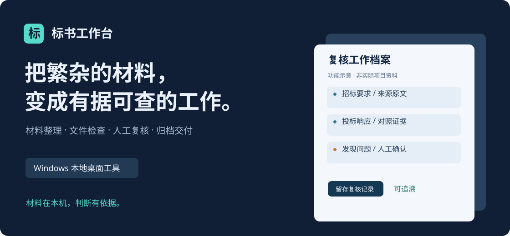
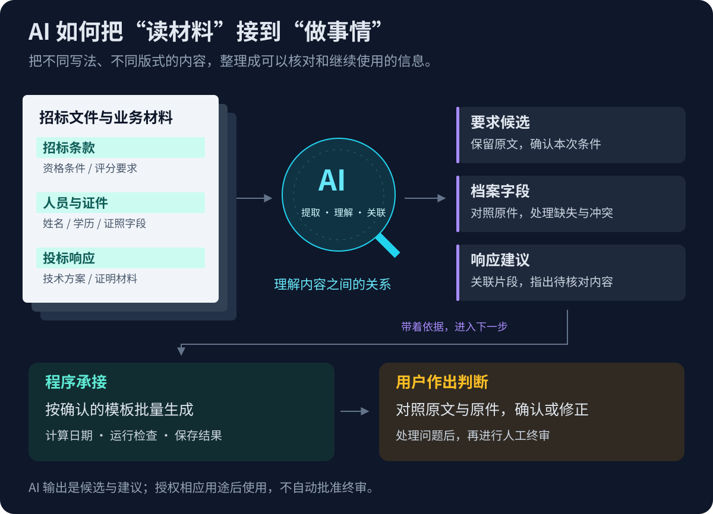
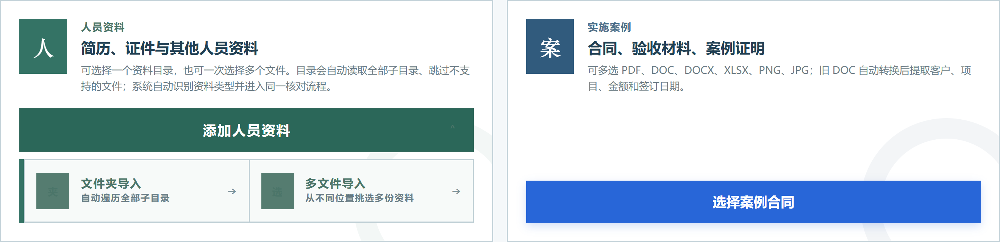
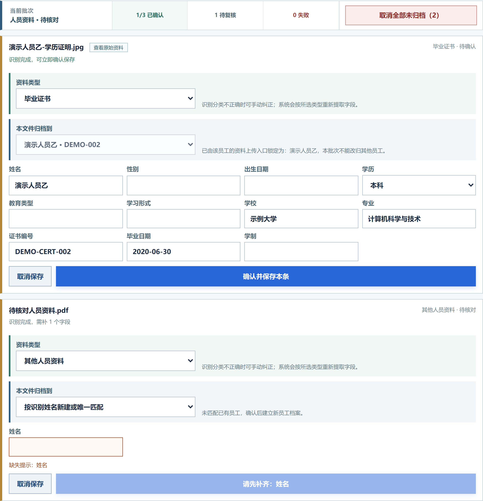
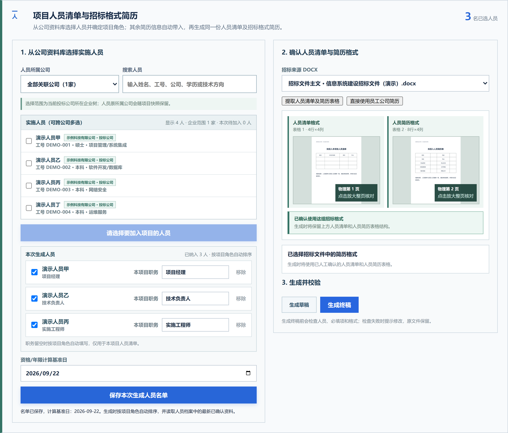
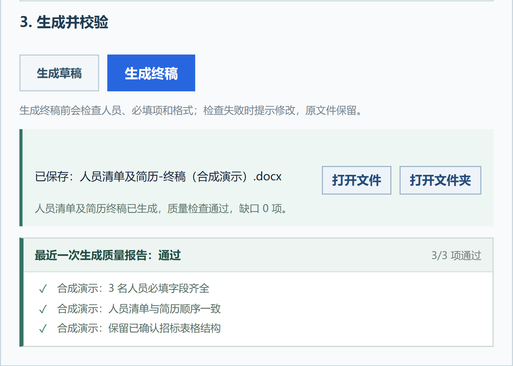
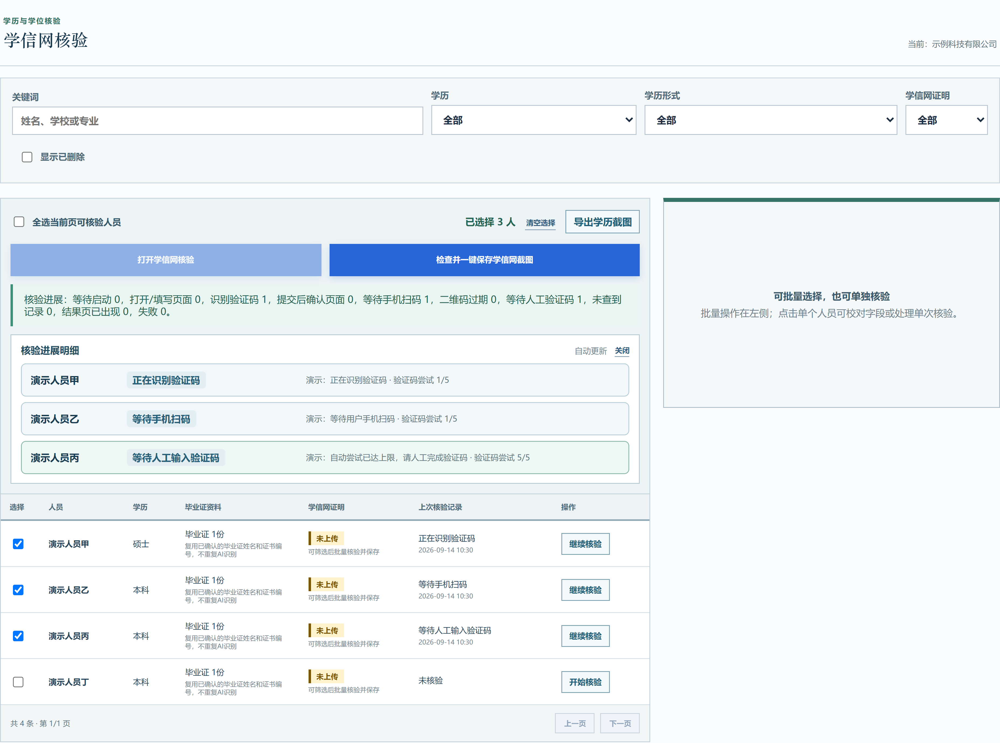
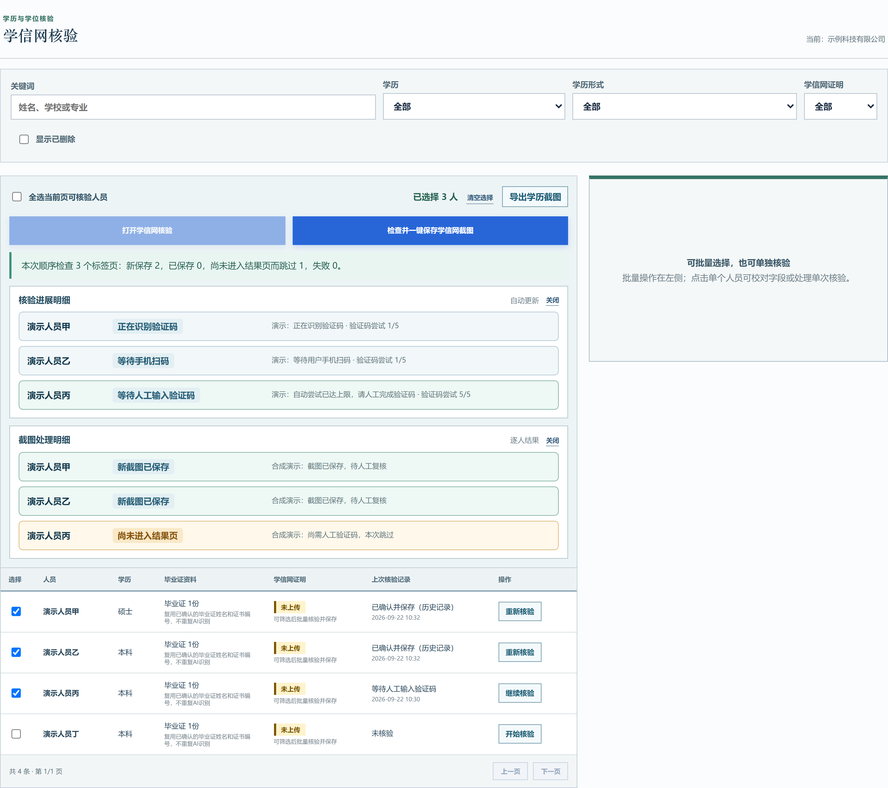
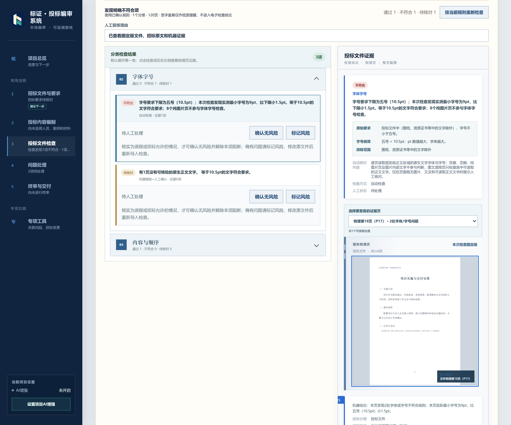

  

  本地解析与编制，AI 按需增强；不接入 AI，也能开展基础工作。 
  让投标人少做重复整理，把精力用在关键要求与方案上。

  <a href="https://github.com/yaoyouzhong/Bidding-releases/releases/download/v0.4.1/Biaoshu_0.4.1_x64-setup.exe"><strong>下载 Windows 安装包 ↗</strong></a>
  &nbsp; · &nbsp;
  <a href="https://github.com/yaoyouzhong/Bidding-releases/releases/latest">版本与下载</a>
  &nbsp; · &nbsp;
  <a href="#开始使用">开始使用</a>
  &nbsp; · &nbsp;
  <a href="#自动更新">自动更新</a>

Windows 10 / 11 · x64 &nbsp;&nbsp; | &nbsp;&nbsp; 本地解析与文字识别 &nbsp;&nbsp; | &nbsp;&nbsp; AI 增强按需开启

  <a href="HELP.md">使用帮助</a> &nbsp; · &nbsp;
  <a href="https://gitee.com/yaoyouzhong/Bidding-releases/releases/tag/models-v1">模型修复文件 · Gitee</a>

本主页在 GitHub 与 Gitee 同步展示。**程序下载与更新仅通过 GitHub 提供**；Gitee 保留功能介绍、使用帮助和模型修复下载。安装包已内置识别所需文件，正常使用无需另行下载模型。

---

> **使用用途：仅供学习与交流，不用于任何商业用途。**
> 本项目免费提供，用于学习和交流文档处理、OCR 与信息核对技术；请勿用于商业投标、收费服务或其他商业活动。
> 第三方组件仍按各自许可证提供；本声明不替代其许可，也不表示已取得第三方额外授权。

## 从准备到交付，把投标工作接起来

反复找资料、换格式、核对要求、追踪修改，常常占去编制方案的大量时间。标书工作台把这些工作放进同一个项目：复用企业、人员与案例资料，按本次招标格式编制，再围绕要求和证据检查、处理与归档。

下面选四个场景，沿着一次操作的前后过程，看工作台怎样减少重复劳动、把待处理问题交到人面前。

截图使用当前程序前端与合成资料、合成结果状态，不含真实业务或个人信息。用于说明操作流程，不代表官网实测或本次后台生成验收。点击图片可查看高清原图。

## 本地就能用，AI 按需增强

**无需配置 AI 服务，也能开始整理、编制和检查。** 文档解析、扫描件文字识别在本机完成；批量导入与资料归档、按已确认模板填充并生成简历、证件日期提醒及已有规则检查，都有本地能力支持。识别所需文件已内置，读不准或缺失的信息可对照原件补充。

**需要进一步理解复杂内容时，再开启 AI。** AI 在本地处理的基础上，辅助理解不同写法的招标要求、不同版式的材料，以及要求和响应之间的关系；这些增强功能需要配置模型并开启相应用途。未开启 AI 时，继续使用本地功能，不会因此无法使用整个工作台。

文档解析、文字识别等基础处理在本机完成，无需接入在线 AI。企业信用查询、学信网学历核验，以及程序版本检查和下载安装更新需要联网。

## AI 的价值，落在下一步能做什么

在本地解析之外，开启 AI 增强后，还可以进一步理解招标要求的不同写法、证件的不同版式，以及未沿用原文表述的响应内容，整理出带依据的要求、档案字段和响应建议，再接入编制与复核。

要求候选能回看招标原文，档案字段能对照原件，响应建议能查看相关片段。AI 还可辅助起草有材料依据的响应草稿，以及在多投标文件复核中分析改写相似等语义线索；这些内容都需要人工确认。

日期计算、模板填充与批量生成由程序完成。AI 增强默认关闭，按用途授权后使用；模型建议不自动变成终审结论。

## 01 · 文件成堆、格式各异，批量整理后继续用

**痛点：** 简历、证件扫描件和合同散落在不同文件夹，有 Word、有 PDF，还有 Excel 和图片。逐份打开、分类、录入，再为每个人或项目归档，重复操作多，也容易遗漏。

**先把一批资料交进来。** 人员资料可选择整个文件夹，自动遍历子目录，也可一次选择多个文件；导入前区分已入库与待解析资料，默认跳过已确认原件，归属不清的项先处理。

支持 **PDF、Word（DOC/DOCX）、Excel（XLSX）、PNG、JPG/JPEG**。人员简历、证件和其他人员资料进入统一核对流程；案例合同、验收证明与企业资料分别从对应批量入口导入。文件夹导入用于人员资料；旧 DOC 转换需要本机 Word。

**系统识别整理，用户核对关键内容。** 根据资料类型提取字段，本地解析与 OCR 承担基础识别，按需开启 AI 辅助理解不同版式的材料。处理结果逐项显示，已完成项可先核对保存，分类不正确可以修正，缺项和失败项单独补充或重试。

**确认后，形成可复用档案。** 原件和已确认信息按人员、案例等归属保存。下一次选人、套招标格式或发起学历核验时，直接从档案带入，不必重新从一堆原文件里找起。

**得到什么：** 从“成批文件”到“可核对、可复用的资料”，把逐份打开、整理和录入串成连续流程。大量资料可以批量组织处理，具体耗时取决于页数、扫描质量和电脑配置。

## 02 · 每换一个项目，不必重新逐人套简历

**痛点：** 人员没有换，招标方的清单、简历表格和字段顺序却变了。复制几十次，不仅费时，也容易串行、漏项或沿用旧项目职务。

**先选人，再确认本次格式。** 从已确认的人员档案中选择本项目人员，设置角色与顺序；查看招标文件中的人员清单和简历表格，核对模板及字段对应关系。

**确认后生成，结果和缺口一起看。** 程序按确认的格式带入档案，输出人员清单与简历 Word；生成结果区提供文件入口、缺项数量和质量报告。需要补充的内容先处理，也可保留草稿继续编制。

**得到什么：** 一次选择、一套已确认格式，批量组织本次人员材料。下个项目继续复用档案，人员选择与编制结果按项目保留。

## 03 · 一批人员的学历核验，进度和缺项看得清

**痛点：** 逐人找证书、填信息、查结果、存截图，操作容易中断；回头又难分清谁已完成、谁还卡在验证环节。

**从档案带入信息，按人跟进查询。** 选择已确认姓名与证书信息的人员，发起批量核验。每个人的验证码识别、扫码或人工处理状态分别展示，遇到需要接手的环节按页面提示完成。

**结果出现后，检查并保存截图。** 查看每个人的保存结果，已完成项与未完成项分别列明；继续处理缺项后再次检查，避免把一批任务开始运行当作全部核验完成。

**得到什么：** 按人对应的核验结果与截图，以及明确的待处理项。以上为前端合成状态演示，未连接学信网，不是官网核验成功证明。

学历核验之外，材料准备还会结合已识别的证件日期提示过期、未生效或日期缺失；是否符合本次招标条件，继续进入下面的要求核对流程。

## 04 · 从“检查出问题”，走到“知道依据、完成处理”

**痛点：** 标书很厚，要求散落在不同章节。看到一个告警还不够，复核人需要知道它依据哪条要求、落在哪一页、怎样处理后才能继续。

**先明确查什么、查哪份文件。** 确认本次招标要求并导入当前投标文件包，分别运行格式与完整性检查、招标要求响应核对。AI 可辅助提取要求和理解响应，核对仍保留来源与待确认状态。

**再把发现展开到依据。** 下图以字号检查为例：招标要求不小于五号（10.5pt），发现最小字号为 9pt。问题、来源要求和对应物理页同屏展示，便于核实是否需要修改。字号判断由程序完成；语义响应核对另外使用相应的要求和响应证据。

**最后处理，再检查当前结果。** 需要整改的项留在待处理清单；人工核实无风险时记录结论。文件修改后核验当前检查是否有效，问题处理与检查完成分别记录，满足条件后进入人工终审与归档。

**得到什么：** 有来源、有位置、有处理记录的问题清单。材料存在不自动等于满足条件，候选评分证据也不自动计分。

## 四个场景，连接同一份项目工作

批量建档将散落文件变成可复用资料；人员简历编制连接档案和招标格式；学历核验连接材料与证明；投标检查连接要求、响应与问题处理。企业整册材料、案例复用、信用查询、多投标文件关联风险复核等能力，也在相应环节提供支持。

最终由用户核实问题、完成人工终审，归档投标原件与复核记录，便于回查。归档后仍需自行递交。

## 开始使用

在 Windows 10 / 11 64 位电脑上下载安装包，首次安装请保持联网。文字识别所需文件已内置，无需另行配置，也不必先接入 AI；企业信用查询和学信网学历核验需要 Google Chrome。

1. **建立资料基础**：创建投标人和项目，导入企业、人员及案例资料，核对后归档。
2. **按本次要求编制**：导入招标文件，确认要求和模板，选择本次使用的材料与人员。
3. **检查并处理问题**：对照原件复核发现，完成整改与人工终审，再保存交付归档。

[下载 Windows 版 0.4.1 ↗](https://github.com/yaoyouzhong/Bidding-releases/releases/download/v0.4.1/Biaoshu_0.4.1_x64-setup.exe) · [安装与使用帮助](HELP.md)

## 自动更新

发现新版本时，应用会提示。保存工作并等待当前任务结束后，在应用设置中点击 **“一键升级”**，完成后程序自动重启。

程序下载和更新目前通过 GitHub 提供。[查看版本说明](RELEASE_NOTES.md)

## 资料与隐私

材料默认保存在本机。AI 增强默认关闭，明确开启相应用途后，相关内容才发送给所配置的模型。企业信用查询和学信网学历核验按用户发起的操作访问对应官方网站，请按业务需要备份重要资料。

反馈问题时，请提供脱敏的操作步骤和错误提示，不要上传真实投标材料或个人证件。

[使用帮助](HELP.md) · [反馈问题](https://github.com/yaoyouzhong/Bidding-releases/issues) · [历史版本](https://github.com/yaoyouzhong/Bidding-releases/releases)

---

本仓库提供程序下载与使用说明，业务源码保持私有。

[第三方组件说明](THIRD_PARTY_NOTICES.md) · [技术与维护说明](TECHNICAL_NOTES.md)

标书工作台 · 整理有序，复核有据。

