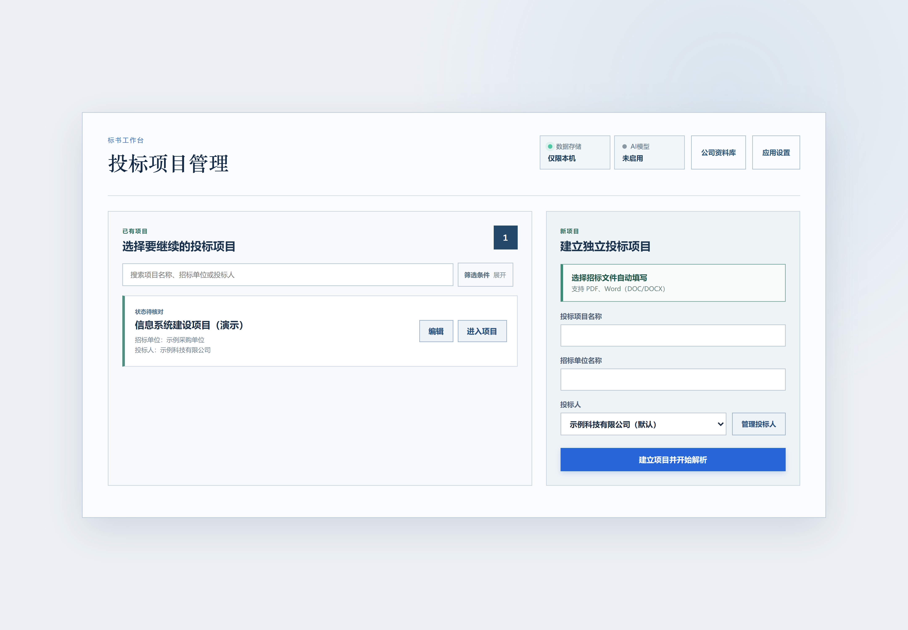

  

  为投标人整理材料、核对要求、定位问题而设计 
  把反复找资料、逐页查问题、逐人做核验，组织成可追溯的复核流程。

  <a href="https://github.com/yaoyouzhong/Bidding-releases/releases/download/v0.4.1/Biaoshu_0.4.1_x64-setup.exe"><strong>下载 Windows 安装包 ↗</strong></a>
  &nbsp; · &nbsp;
  <a href="https://github.com/yaoyouzhong/Bidding-releases/releases/latest">版本与下载</a>
  &nbsp; · &nbsp;
  <a href="#开始使用">开始使用</a>
  &nbsp; · &nbsp;
  <a href="#自动更新">自动更新</a>

Windows 10 / 11 · x64 &nbsp;&nbsp; | &nbsp;&nbsp; 本地资料管理 &nbsp;&nbsp; | &nbsp;&nbsp; AI 增强按需开启

---

> **使用用途：仅供学习与交流，不用于任何商业用途。**
> 本项目免费提供，用于学习和交流文档处理、OCR 与信息核对技术；请勿用于商业投标、收费服务或其他商业活动。
> 第三方组件仍按各自许可证提供；本声明不替代其许可，也不表示已取得第三方额外授权。

## 投标准备中的重复与遗漏，怎样减少？

准备一份投标文件，常常要同时处理几件事：从旧项目找材料、确认本次招标要求、检查多份分册、逐人核验学历，再在交付前追问哪些问题还没处理。资料、依据和处理记录分散时，每一步都要重新查找、核对。

标书工作台围绕这些工作组织功能：**资料按归属保存，检查按招标要求执行，发现回到原件复核，处理结果留在当前项目。**

| 投标人遇到的困扰 | 系统如何帮助处理 |
| :--- | :--- |
| 每个项目都要重新找证照、简历和案例 | 企业、人员和案例集中归档，保留来源与审核状态，供项目检索和选用。 |
| 招标文件很长，格式与响应要求容易漏看 | 从招标来源整理要求，人工确认后分别开展格式检查和响应核对。 |
| 看到一条告警，还要翻文件找依据 | 将问题、招标要求、投标文件物理页放在同一复核视图。 |
| 多人学历核验，需要反复填信息、切页面、存截图 | 复用已确认字段，批量打开查询，逐人跟进并保存可用结果。 |
| 临近交付，难以确认查过什么、改完没有 | 保留检查与人工处理记录，检查终审条件，确认后归档原件与记录。 |

以下为当前前端的合成数据演示，不含真实业务或个人资料。截图以 3 倍像素密度重新渲染；可通过图下链接打开高清原图查看细节。

## 同样的材料，每次都要重新找、重新整理？

营业执照在一个文件夹，人员证书在另一个文件夹，案例又藏在过去的投标文件里。准备新项目时，先要找齐资料，再核对归属和版本。

**把资料整理成可复用的档案。** 企业证照、人员证书和实施案例按归属集中保存，OCR 辅助提取后由人工核对。具体项目再检索和选用，来源、审核状态和原件保持关联。

[查看高清原图 ↗](assets/screen-company-hd.png?raw=true)

**一次归档，后续检索和选用更方便。** 企业材料按类别查看；人员可按学历、学校专业和技术方向筛选；案例按客户归组。

<strong>查看人员档案、案例台账与批量建档</strong>

人员档案把简历、学历证明和专业证书归到同一人，便于选人时核对材料。

[查看高清原图 ↗](assets/screen-personnel-hd.png?raw=true)

案例台账按客户整理项目、合同金额、签订时间和项目内容。

[查看高清原图 ↗](assets/screen-cases-hd.png?raw=true)

从人员资料或案例合同开始批量建档，识别后逐项核对。

[查看高清原图 ↗](assets/screen-import-hd.png?raw=true)

## 招标要求分散，担心漏看、漏响应？

资格、格式、技术响应和评分要求可能分散在不同章节。仅凭通用检查清单，难以覆盖本项目的具体要求。

**先明确本次要求，再检查当前文件。** 系统从招标来源整理要求，保留原文与定位供人工确认；格式与完整性检查、招标要求响应核对分别保留结果，避免把格式通过当成响应齐全。无法确定的内容保留待核对状态。

<strong>查看招标规则确认与投标文件检查界面</strong>

检查以当前招标文件中已确认的规则为依据，绑定本次投标文件包；通过、不符合和待核对分别展示。格式与完整性检查、招标要求响应核对分别保留结果。

[查看高清原图 ↗](assets/screen-inspection-hd.png?raw=true)

## 发现了问题，却还要来回翻文件找依据？

一句“字号不符合”不足以决定怎样修改：还要知道招标要求是什么、哪些内容可以排除，以及问题落在哪一页。

**把判断所需的信息放到一起。** 左侧查看检查发现，右侧对照原始要求与投标文件物理页；看清依据后，再记录人工结论或修改文件后重新检查。

[查看高清原图 ↗](assets/screen-evidence-hd.png?raw=true)

图中以字号检查为例：要求不小于五号（10.5pt），发现的最小字号为 9pt。复核时可以同时看到判定依据、排除范围和对应页面，再决定整改或确认无风险。

## 一批人员的学历核验，要重复操作很多遍？

人员一多，重复输入姓名与证书编号、切换查询页面、辨认谁已完成、逐张保存截图，都需要持续跟进。

**把重复步骤批量处理，把需要人的环节单独列明。** 已确认字段直接带入，每人建立独立查询标签页；工作台逐人显示验证码识别、等待扫码和人工接手进展。

[查看高清原图 ↗](assets/screen-chsi-progress-hd.png?raw=true)

**谁已出结果、谁还需要操作，分别列明。** 结果页出现后可检查并批量保存截图；尚未完成验证的人员单独列出，完成后再检查。需要扫码或人工验证码时，由用户完成。

<strong>查看批量保存截图后的逐人处理明细</strong>

[查看高清原图 ↗](assets/screen-chsi-results-hd.png?raw=true)

以上核验状态来自合成演示，未连接学信网，不是官网核验成功证明。

## 文件改了几轮，交付前怎么确认都处理好了？

“运行过检查”和“问题已解决”是两件事。文件修改后，还需要确认检查是否对应当前版本、哪些发现已经复核、哪些事项仍待处理。

**围绕当前文件包保留处理记录。** 系统区分检查完成与问题解决，终审时核验当前条件；满足条件并经人工确认后，保存包含原件和复核记录的归档，供后续回查。归档后仍须自行递交。

多家公司文件还可使用**关联风险检查**，查看内容命中、公司名称交叉等线索。机器提示供人工判断，不自动认定合规、计分或串标成立。

<strong>查看项目管理入口</strong>

[查看高清原图 ↗](assets/workspace-hd.png?raw=true)

**本地优先，AI 按需开启。** 材料默认保存在本机，AI 增强默认关闭；开启相应用途后才发送相关内容。官网查询按用户操作访问对应网站。

## 开始使用

[程序下载 · GitHub](https://github.com/yaoyouzhong/Bidding-releases/releases) · [模型修复 · Gitee](https://gitee.com/yaoyouzhong/Bidding-releases/releases/tag/models-v1)

Gitee 模型修复文件已可用。Gitee 单个附件上限为 100 MB，无法容纳本版完整安装包和程序更新包；程序下载与更新目前均由 GitHub 提供。

**1. 安装工作台**  
普通用户选择 **EXE 安装包**，保留默认安装位置即可使用应用内更新。无需另装 Python、Node 或 Rust。

**2. 建立投标人和项目**  
按当前项目整理企业、人员资料，导入招标文件与投标文件。

**3. 检查、复核、归档**  
结合原件核对检查结果，处理问题，再进行人工终审与交付归档。

| 安装方式 | 适合的使用方式 | 下载 |
| :--- | :--- | :--- |
| **EXE · 推荐** | 当前用户安装，支持应用内更新 | [下载 0.4.1](https://github.com/yaoyouzhong/Bidding-releases/releases/download/v0.4.1/Biaoshu_0.4.1_x64-setup.exe) |

<strong>安装环境与下载校验</strong>

- 支持 Windows 10 / 11 x64。
- 界面使用 Microsoft Edge WebView2，首次安装建议保持联网。
- 企业信用与学历官网查询需要安装 Google Chrome；需要人工验证时，按官网提示操作。
- 安装包尚未取得 Windows Authenticode 签名；可通过同版 [SHA256SUMS.txt](https://github.com/yaoyouzhong/Bidding-releases/releases/download/v0.4.1/SHA256SUMS.txt) 核对文件完整性。

## OCR 模型

安装包已内置 Beta 验证码识别和文档检测、识别、方向共 4 个 OCR 模型，安装后可直接进行本地识别。应用设置保留“下载模型”和“导入模型”，用于缺失或损坏时修复；模型完整时显示已就绪。

如需离线修复，下载下列原始 `.onnx` 文件，点击“导入模型”选择一个或多个文件。旧版模型附件继续保留，本版只使用以下四个。

<strong>四个模型修复文件</strong>

| 用途 | 文件 | 国内下载 | 备用下载 |
| :--- | :--- | :--- | :--- |
| 验证码 Beta | `common.onnx` | [Gitee](https://gitee.com/yaoyouzhong/Bidding-releases/releases/download/models-v1/common.onnx) | [GitHub](https://github.com/yaoyouzhong/Bidding-releases/releases/download/models-v1/common.onnx) |
| 文档文字检测 | `PP-OCRv6_det_small.onnx` | [Gitee](https://gitee.com/yaoyouzhong/Bidding-releases/releases/download/models-v1/PP-OCRv6_det_small.onnx) | [GitHub](https://github.com/yaoyouzhong/Bidding-releases/releases/download/models-v1/PP-OCRv6_det_small.onnx) |
| 文档文字识别 | `PP-OCRv6_rec_small.onnx` | [Gitee](https://gitee.com/yaoyouzhong/Bidding-releases/releases/download/models-v1/PP-OCRv6_rec_small.onnx) | [GitHub](https://github.com/yaoyouzhong/Bidding-releases/releases/download/models-v1/PP-OCRv6_rec_small.onnx) |
| 文字方向 | `ch_ppocr_mobile_v2.0_cls_mobile.onnx` | [Gitee](https://gitee.com/yaoyouzhong/Bidding-releases/releases/download/models-v1/ch_ppocr_mobile_v2.0_cls_mobile.onnx) | [GitHub](https://github.com/yaoyouzhong/Bidding-releases/releases/download/models-v1/ch_ppocr_mobile_v2.0_cls_mobile.onnx) |

## 自动更新

**从 0.3.0 开始，更新能力已包含在程序中。**

启动后自动检查新版本。发现更新时，应用设置中显示提醒；查看说明、保存工作并确认后，点击 **「一键升级」**，程序会下载并验证签名，安装完成后重启。

更新前保留旧版备份，新版启动失败时尝试恢复旧版。后台任务运行期间不能安装更新；历史机器级 MSI 安装，以及涉及数据库结构变化的版本，使用另行验证的完整安装包升级。

## 当前版本

**0.4.1** 内置完整 OCR 模型，安装后无需单独下载；程序安装包、更新清单和签名更新包目前由 GitHub 提供，更新时验证包签名。下载模型与导入模型入口继续保留。

GitHub 保留程序历史版本。Gitee 目前仅同步使用说明与模型修复文件，不作为程序发布源或更新备用源。

[阅读完整版本说明 →](RELEASE_NOTES.md)

<strong>已验证范围与当前边界</strong>

- 0.4.1 安装包内置四个固定模型，冻结引擎模型检查与 Beta 验证码识别通过；安装包和签名更新包内的程序文件一致。
- v0.4.0 EXE 与 MSI 分别完成独立 Windows Sandbox 安装生命周期与合成业务验证。
- v0.3.0 → v0.4.0 的正常升级与中断恢复已验证，并核对项目数据库保持不变。
- 本轮不包含无 WebView2 的离线安装、同版本覆盖安装、真实个人学信网查询及跨机器 GPU 性能验收。

## 数据与可选 AI

材料默认保存在本机。AI 增强默认关闭，配置模型并明确开启相应用途后，才发送相关内容。官网查询按用户发起的操作访问对应网站；请按业务需要备份重要资料。

反馈问题时，请提供脱敏后的操作步骤和错误提示，**不要上传真实投标材料、身份证件、项目数据库或密钥**。

## 关于本仓库

这里是标书工作台的**公开分发仓库**，提供安装包、签名更新包、校验值与使用说明。业务源码及开发历史保留私有。

[第三方组件说明](THIRD_PARTY_NOTICES.md) · [GEOS 分发与兼容库说明](GEOS_DISTRIBUTION.md) · [全部版本](https://github.com/yaoyouzhong/Bidding-releases/releases)

第三方许可证与源码资料

Release 中的 `licenses.zip` 提供第三方许可证原文，`sources.zip` 仅包含第三方库源码及构建参考，不是标书工作台业务源码。相关材料也位于安装目录的 `third-party.zip`，随程序更新或恢复。

第三方组件按各自许可证提供，相应权利不受本程序其他说明限制。GEOS 的使用与修改权利见对应说明，普通用户无需替换该库。

---

标书工作台 · 整理有序，复核有据。

